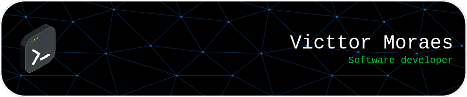

  
  

I am currently a student at 42 Porto. I really enjoy learning languages ​​and frameworks and maybe discover how to make the world better.

<h2> :fleur_de_lis: Tech Stack </h2>

  

<h2> :wrench: Tools I've been using </h2>

  
  

<h2> 💻 Projects </h2>

<a href="https://github.com/victtorm/42">

